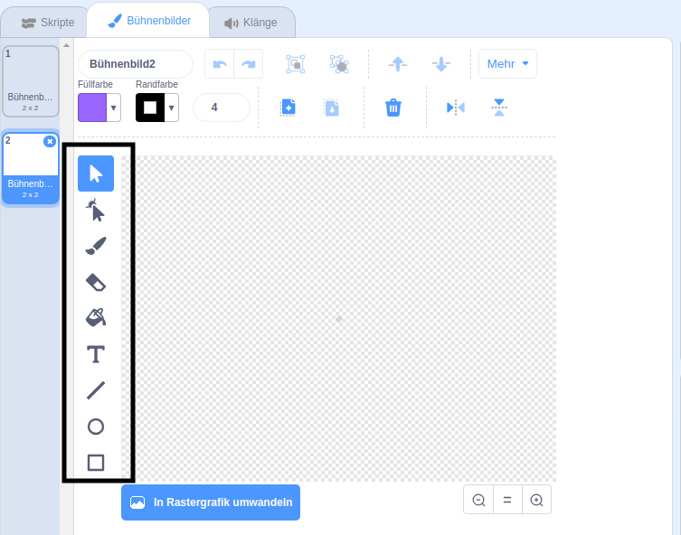

+ Wähle das Symbol **Bühnenbild** unten rechts und klicke auf "Malen"

+ Verwende die Zeichenwerkzeuge im Register **Bühnenbilder**, um dein neues Bühnenbild zu zeichnen.

+ Wenn du fertig bist, vergiss nicht, deiner neuen Kulisse einen vernünftigen Namen zu geben.