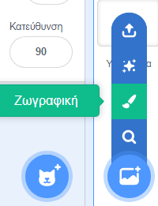
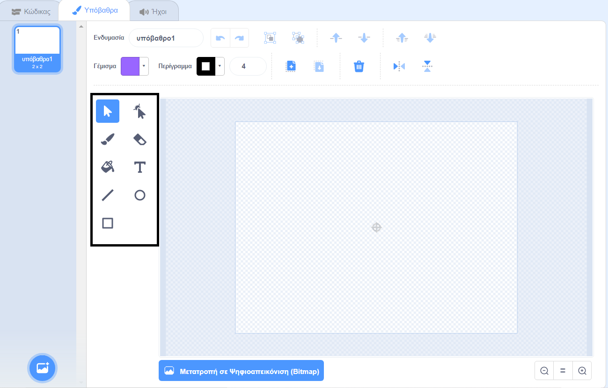

+ Επίλεξε το **Επιλέξτε Υπόβαθρο** κάτω δεξιά και κάνε κλικ στο "Ζωγραφική"

+ Χρησιμοποίησε το εργαλείο σχεδίασης της καρτέλας **Υπόβαθρα** για να ζωγραφίσεις το νέο σου υπόβαθρο.

+ Όταν τελειώσεις μην ξεχάσεις να δώσεις στο νέο σου υπόβαθρο ένα όνομα που θα αποδίδει τη σημασία του.