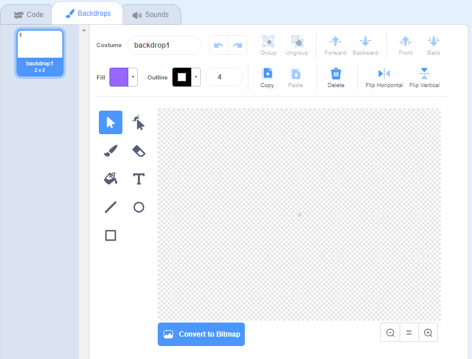

+ Select the **backdrop** icon in the bottom right and click on "Paint"

+ Use the drawing tools in the **Costumes** tab to paint your backdrop.

+ When you are finished, don’t forget to give your new backdrop a sensible name.
