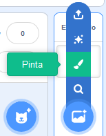
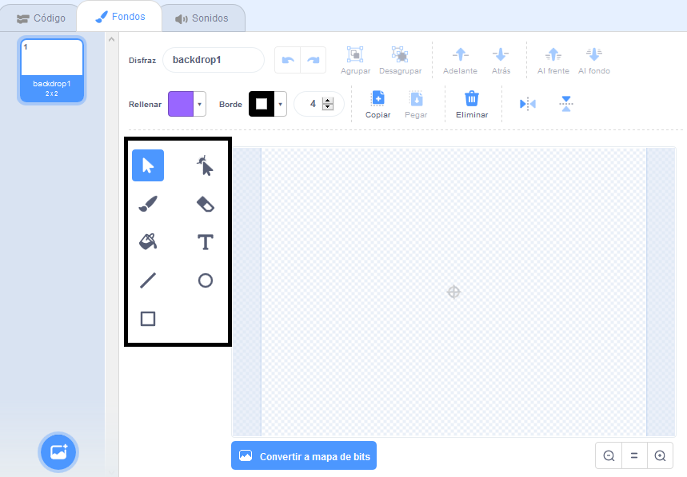

+ Selecciona el icono **Fondos** en la parte inferior derecha y haz clic en "Pinta"

+ Usa las herramientas de dibujo en la pestaña **Fondos ** para pintar tu fondo.

+ Cuando hayas terminado, no olvides dar un nombre adecuado a tu nuevo fondo.