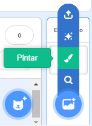
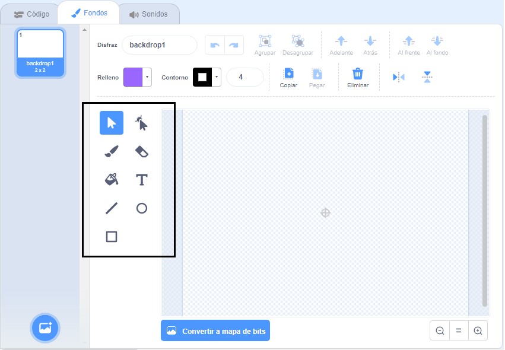

+ Selecciona el icono **Fondos** en la parte inferior derecha y haz clic en "Pintar"

+ Usa las herramientas de dibujo en la pestaña **Fondos** para pintar tu fondo.

+ Cuando termines, no te olvides de ponerle a tu nuevo fondo un nombre.