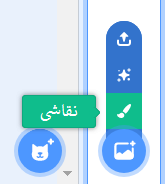
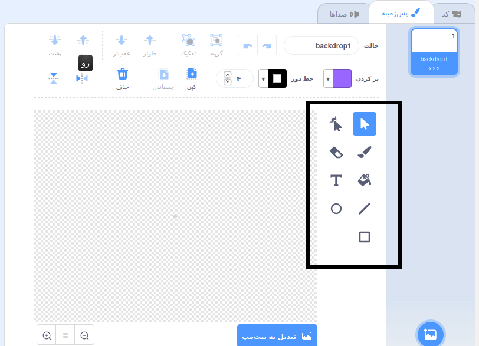

+ آیکون **پس زمینه** در قسمت پایین سمت چپ را انتخاب کنید و بر روی "نقاشی" کلیک کنید

+ از ابزارهای طراحی در قسمت **پس زمینه** استفاده کنید تا پس زمینه خودتان را بکشید.

+ هنگامی که کار شما به پایان رسید، فراموش نکنید که یک نام مناسب برای پس زمینه جدیدتان انتخاب کنید.