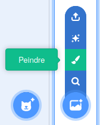
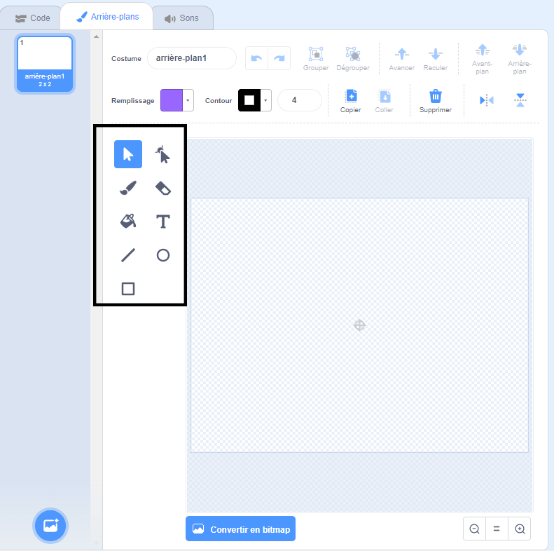

+ Sélectionne l'icône **arrière plan** en bas à droite et clique sur « Peindre »

+ Utilise les outils de dessin dans l'onglet **Arrière-plan** pour peindre ton arrière-plan.

+ Quand tu as terminé, n’oublie pas de donner à ton nouvel arrière-plan un nom sensé.