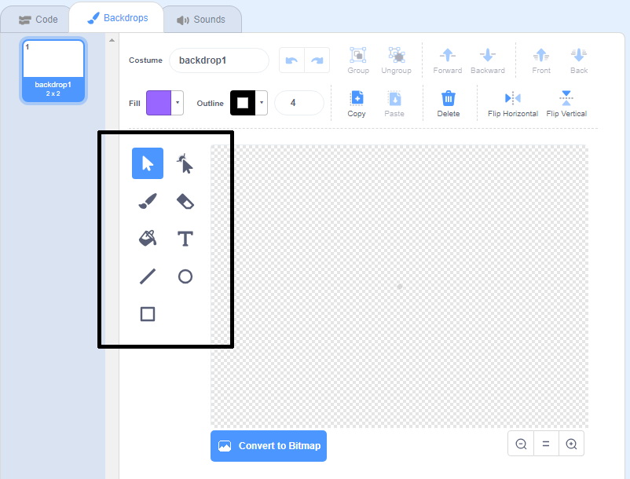

+ नीचे दाईं ओर **backdrop** आइकन का चयन करें, और "Paint" पर क्लिक करें

+ अपनी पृष्ठभूमि को चित्रित करने के लिए **Backdrops** टैब्स में ड्राइंग टूल का उपयोग करें |

+ जब आप समाप्त कर लें, तो अपनी नई पृष्ठभूमि को एक समझदार नाम देना न भूलें।