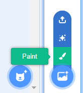

+ खाली उजव्या बाजूला **बॅकड्रॉप** चिन्ह निवडा आणि "पेंट" वर क्लिक करा

+ Use the drawing tools in the **Backdrops** tab to paint your backdrop.

+ जेव्हा आपण संपवाल तेव्हा आपले नवीन पार्श्वभूमी एक अर्थपूर्ण नाव देणे विसरू नका.