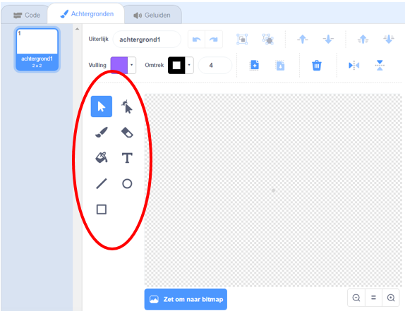

+ Selecteer het pictogram **achtergrond** in de rechterbenedenhoek en klik op "Tekenen"

+ Gebruik de tekenhulpmiddelen op het tabblad **Achtergronden** om je achtergrond te tekenen.

+ Vergeet niet om je achtergrond een goede naam te geven als je klaar bent.