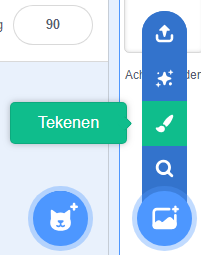
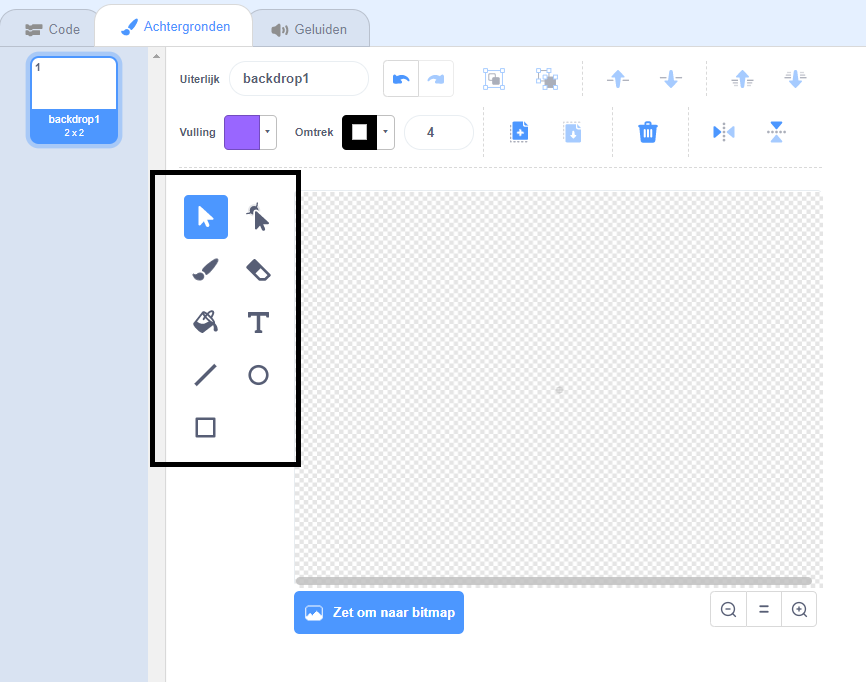

+ Selecteer het pictogram **achtergrond** in de rechterbenedenhoek en klik op "Tekenen"

+ Use the drawing tools in the **Backdrops** tab to paint your backdrop.

+ Vergeet niet om je achtergrond een goede naam te geven als je klaar bent.