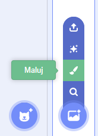
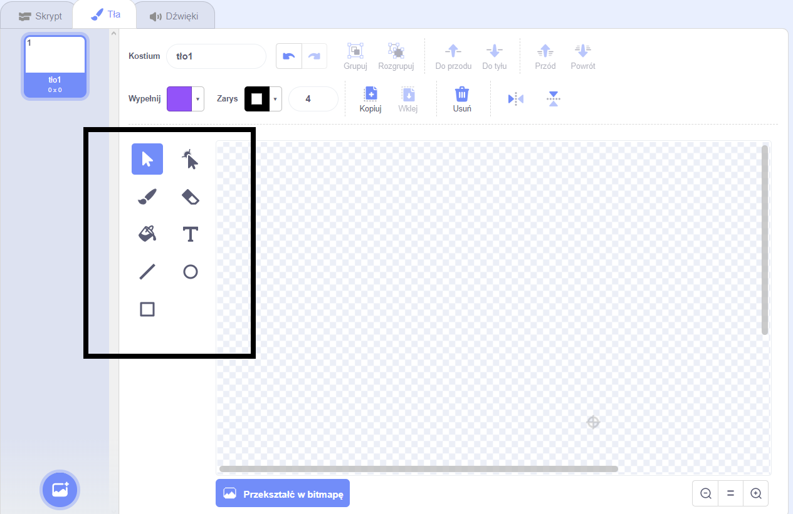

+ Wybierz ikonę **Tło** w prawym dolnym rogu i kliknij „Maluj”

+ Użyj narzędzi do rysowania w zakładce **Tło**, aby pomalować tło.

+ Kiedy skończysz, nie zapomnij nadać swojemu nowemu tle rozsądnej nazwy.