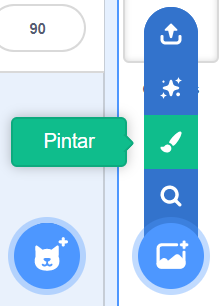
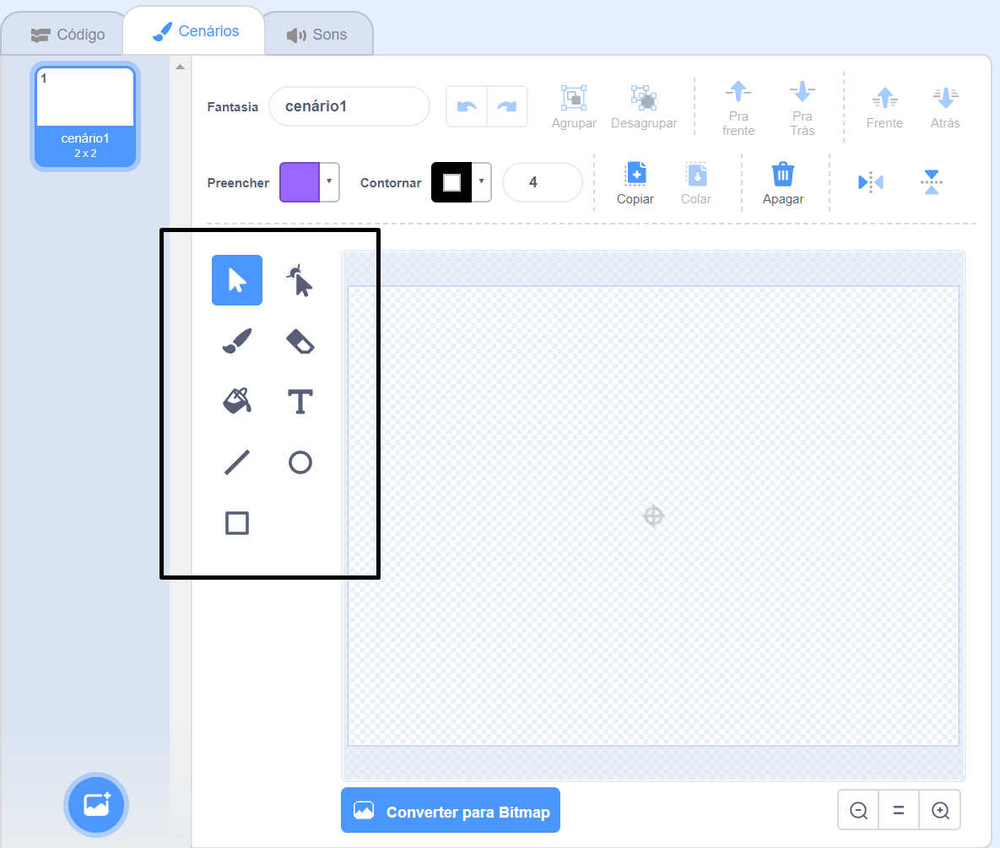

+ Selecione o ícone **cenários** no canto inferior direito e clique em "Pintar"

+ Use as ferramentas de desenho na aba **Cenários** para pintar seu cenário.

+ Quando terminar, não se esqueça de dar um bom nome ao seu cenário.