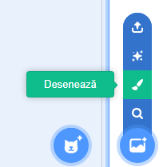
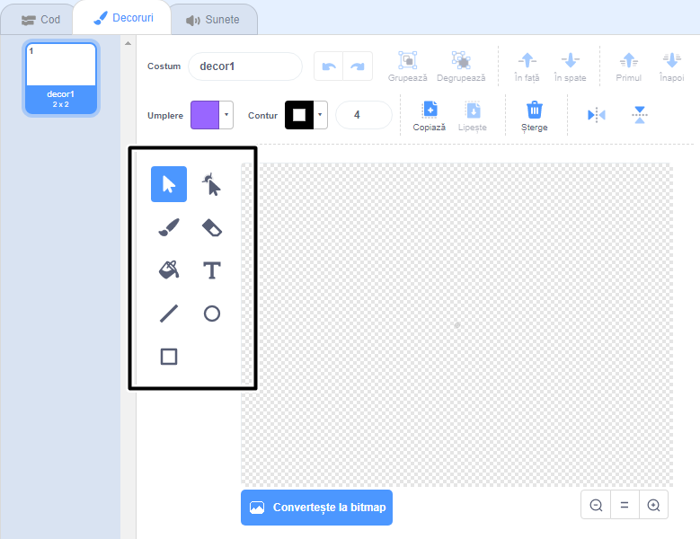

+ Selectează pictograma **Alege un decor** din dreapta jos, iar apoi dă click pe „Desenează”

+ Folosește instrumentele de desenat din tab-ul **Decoruri** pentru a desena fundalul tău.

+ După ce ai terminat, nu uita să dai un nume potrivit noului tău fundal.