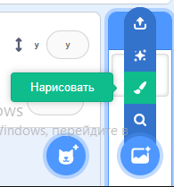
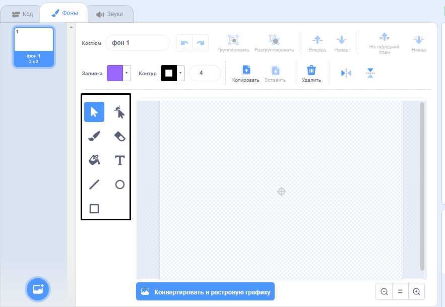

+ Выбери иконку**фон** в правом нижнем углу и нажми «Нарисовать»

+ Используй инструменты рисования из вкладки **Фоны**, чтобы нарисовать свой новый фон.

+ Когда закончишь, не забудь дать твоему новому фону понятное имя.