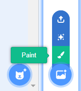

+ පහළ දකුණේ ඇති ** පසුබිම්(backdrop) ** නිරූපකය(icon එක) තෝරා "තීන්ත(paint)" මත ක්ලික් කරන්න

+ ** පසුබිම්(Backdrops) ** පටිත්තේ(tab) ඇති ඇඳීම්(drawing) මෙවලම්(tools) භාවිතා කර ඔබේ පසුබිමේ(backdrop එකේ) තීන්ත ආලේප(paint) කරගන්න.

+ ඔබ අවසන් වූ පසු, ඔබගේ නව පසුබිමට(backdrop එකට) හොඳ නමක් ලබාදීමට අමතක නොකරන්න.