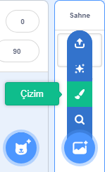
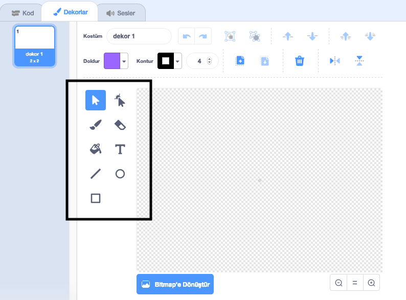

+ Sağ alttaki **Bir Dekor Seç** simgesinin üzerine gelin ve "Çizim" seçeneğini tıklayın

+ Dekorunuzu çizmek için **Dekorlar** sekmesindeki çizim araçlarını kullanın.

+ Bitirdiğinizde, yeni dekora anlamlı bir isim vermeyi unutmayın.