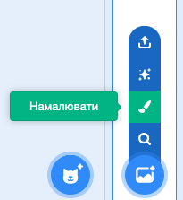
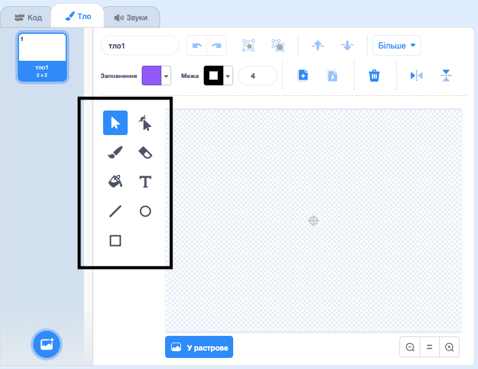

+ Клацни іконку **тло** в нижньому правому кутку і вибери «Намалювати».

+ Використовуй інструменти для малювання на вкладці **Тло**, щоб намалювати своє тло.

+ Коли закінчиш, не забудь дати своєму тлу логічне ім’я.